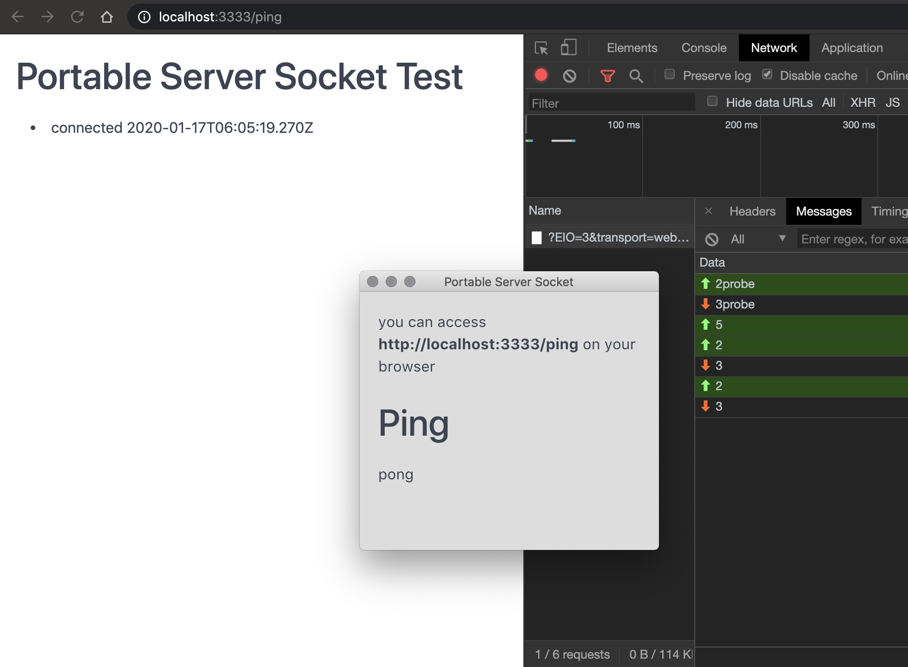

# Portable server socket
> part of Yuri's project



[User Manual](./build/docs/README.md)

## Looking for a compiled app?
TODO: add link here

## Getting Started
### Prerequisites
```bash
npm install:all
```
### Build
```bash
npm run build
```

### Development
``` bash
npm run dev
```

#### Socket server isolation
> to run the socket server isolated run
``` bash
node app/socket-isolation-test.js
```
> then access to connect clients
``` bash
http://localhost:3333/ping
```
> then access to get the connected clients
``` bash
http://localhost:3333/api/clients
```

