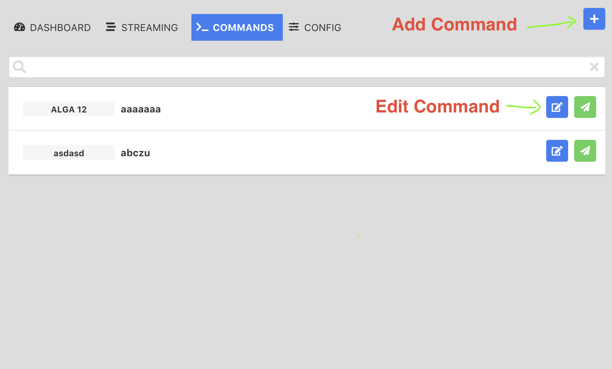
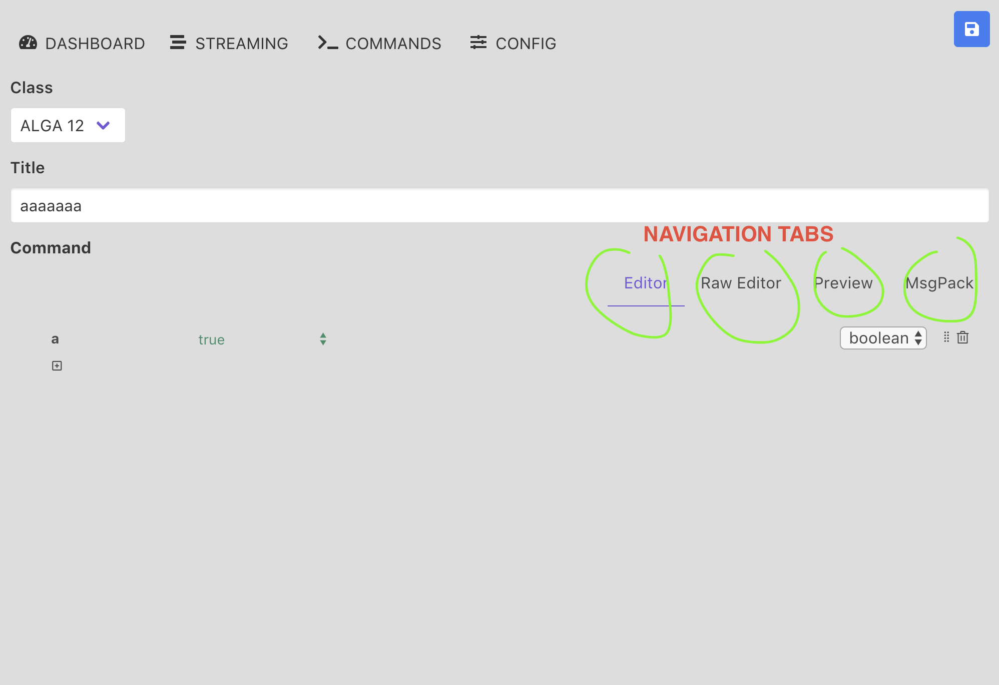
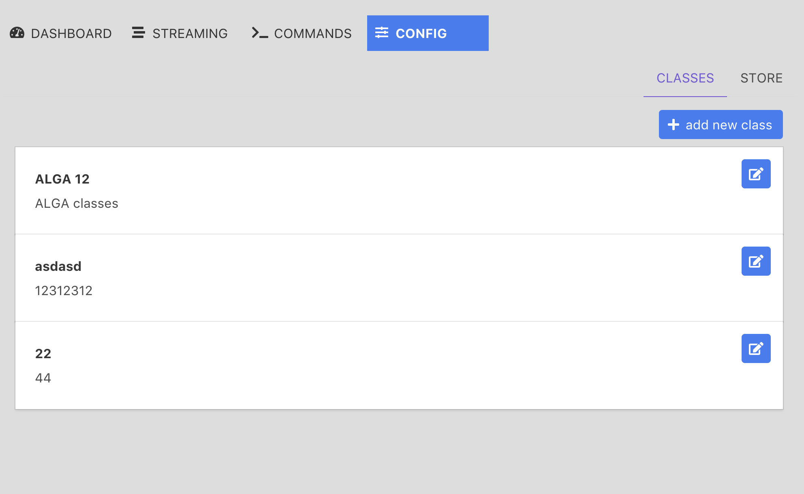

# Portable server socket
> part of Yuri's project

## Overview
> simple user manual

#### Commands
> list of commands

> editing / creating a command

#### Classes
> list of classes they are part of the CONFIG module tab Classes

> editing / creating a class

